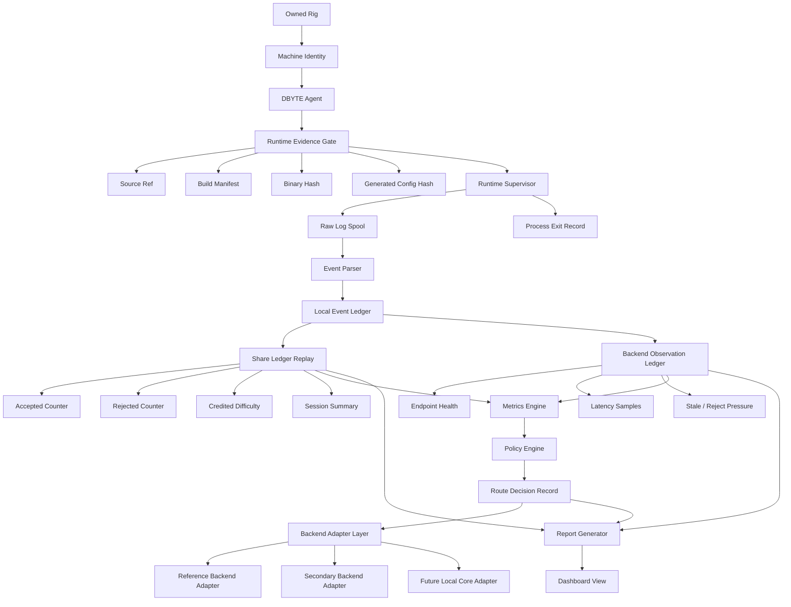

# DBYTE-OCEAN Advanced Core Architecture

This document defines the long-range architecture for DBYTE-OCEAN after the first local agent and evidence layers are stable.

The goal is not to clone an existing public service blindly. The goal is to build a local-first, evidence-driven mining operations core where every decision can be replayed from local facts: machine identity, runtime build evidence, raw logs, parsed events, share ledger state, backend observations, and route decisions.

## Design thesis

DBYTE-OCEAN should compete through correctness, auditability, and operator control:

- local evidence before dashboard state;
- replayable ledgers before live opinions;
- explicit decisions before automatic switching;
- replaceable adapters before single-backend dependency;
- deterministic reports before visual polish;
- owned-machine operation before any wider service model.

The architecture must stay hostile to ambiguity. If a module cannot explain what it observed, what it trusted, and why it acted, that module is not production-ready.

## System pipeline



## Core layers

### 1. Evidence gate

The evidence gate is the trust boundary. It approves or refuses a runtime based on local artifacts, not on user memory or dashboard state.

Required facts:

```text
source_ref
source_commit
build_host
build_toolchain
binary_path
binary_sha256
generated_config_path
generated_config_sha256
operator_launch_intent
```

If any required fact is missing or mismatched, the runtime is refused.

### 2. Runtime supervisor

The supervisor owns process lifetime. It starts, stops, records, and refuses. It does not hide, disguise, or persist itself outside explicit operator control.

Supervisor outputs:

```text
runtime_started
runtime_stdout_line
runtime_stderr_line
runtime_exited
runtime_restart_requested
runtime_launch_refused
```

### 3. Event parser

The event parser converts raw evidence into typed local events. It must preserve raw logs so parser bugs are auditable.

Parser rule: losing a line is worse than failing to parse a line.

### 4. Share ledger replay

The share ledger is the first real competitive foundation. It turns noisy runtime observations into deterministic counters:

```text
total_events
accepted_events
rejected_events
credited_difficulty
session_count
```

Counters must come from replayed local events, not from a dashboard scrape.

### 5. Backend observation ledger

Backend observations are separate from share acceptance. A backend may be reachable but poor, reachable but stale-heavy, or unreachable but not at fault if the local network is broken.

The observation ledger should track:

```text
backend_profile
connectivity_status
latency_ms
stale_pressure
reject_pressure
last_error_class
observation_ts_unix
```

### 6. Metrics engine

The metrics engine normalizes local facts into decision inputs. It should avoid magical scores until the raw counters are stable.

Initial metrics:

```text
accepted_rate
rejected_rate
stale_pressure
session_uptime
restart_pressure
backend_latency_p50
backend_latency_p95
credited_difficulty_rate
```

### 7. Policy engine

The policy engine is not allowed to act silently. Every route decision must emit a reason record.

Required decision fields:

```text
decision_schema
decision_ts_unix
decision_status
decision_reason
previous_backend
selected_backend
accepted_rate
rejected_rate
stale_pressure
restart_pressure
operator_mode
```

The first policy should be conservative: observe, warn, and explain before switching.

### 8. Backend adapter layer

Adapters isolate backend-specific details from policy. The policy engine should depend on normalized observations, not backend-specific response shape.

Adapter responsibilities:

```text
load_backend_profile
check_backend_health
normalize_backend_status
record_backend_observation
return_operator_safe_summary
```

Adapters must not store private operator values in committed fixtures.

### 9. Report generator

Reports are replay artifacts. The dashboard is allowed to render reports but not invent truth.

Report rule: if a report cannot be regenerated from stored evidence, it is not a source of truth.

## Failure modes

The architecture must explicitly handle:

- unknown binary;
- stale build manifest;
- generated config mismatch;
- raw log missing;
- parser rejects a line;
- event ledger sequence gap;
- duplicate accepted share;
- backend unreachable;
- backend reachable but high-latency;
- repeated runtime exit;
- policy wants to switch too frequently;
- dashboard report index stale.

## Implementation order

Do not jump straight to routing. The correct order is:

```text
1. local evidence fields
2. report index integration
3. runtime session event schema
4. parser fixture tests
5. share ledger replay fixtures
6. backend observation fixtures
7. metrics report
8. policy decision report
9. dashboard display
10. controlled adapter expansion
```

## Operator rule

DBYTE-OCEAN is an operator-owned system. It should never depend on hiding, surprise execution, private credential leakage, or unreviewable automation.

The machine may work hard, but it must always speak plainly.
