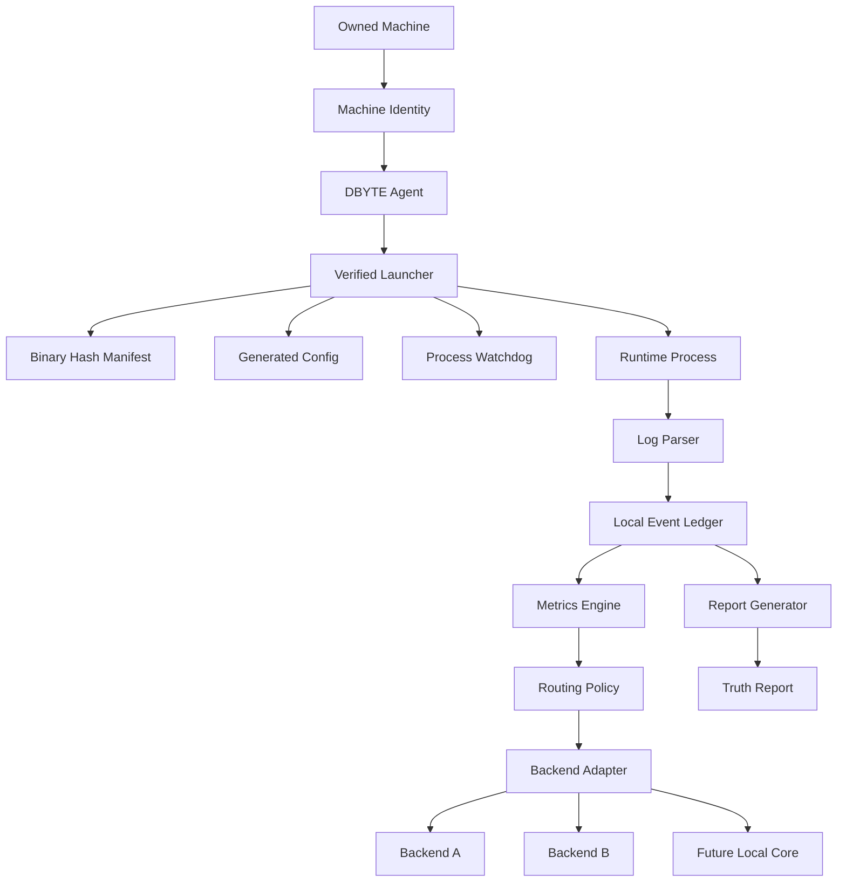

# DBYTE-OCEAN Architecture

This document defines the first architecture layer: machine truth, verified launch, routing policy, and reproducible reporting.

## Layer 1: Machine Identity

The machine identity layer records stable facts about the machine: name, CPU model, thread count, memory profile, platform, and operator notes.

## Layer 2: Verified Launcher

The launcher refuses to start an unknown binary. It records the binary path, expected hash, generated configuration path, launch time, exit code, and restart reason.

## Layer 3: Log Parser

The parser converts process output into structured local events. Raw logs remain available. Parsed events are append-only where practical.

## Layer 4: Routing Policy

Routing decisions must be explicit. The policy engine may choose between backends, but every switch must produce a reason in the local ledger.

## Layer 5: Report Generator

Reports must be reproducible from stored local events. The dashboard is only a view over the recorded truth, not the source of truth.
