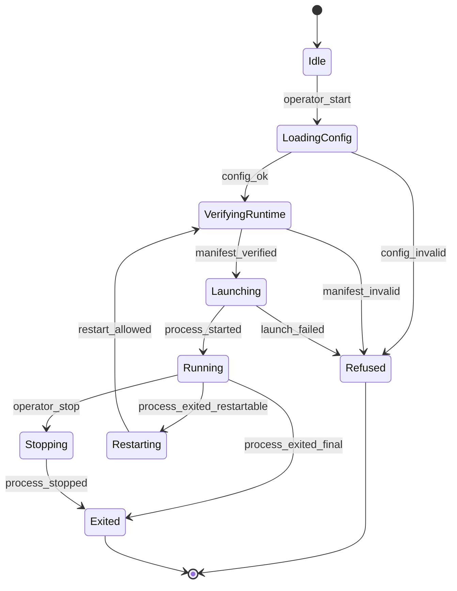

# Rig Agent Contract

The rig agent is the local owner of machine truth. It does not mine by itself. It identifies the machine, verifies the approved runtime worker, launches the worker explicitly, captures runtime evidence, and writes local events that later layers can replay.

## Responsibilities

The agent is responsible for:

- loading the canonical rig configuration;
- deriving stable machine identity;
- checking approved runtime build manifests;
- checking generated runtime configuration manifests;
- launching the worker only after verification passes;
- supervising process lifetime;
- preserving raw stdout and stderr;
- parsing selected runtime observations into local JSONL events;
- recording every restart, refusal, and exit reason.

The agent is not responsible for:

- hiding or disguising runtime work;
- installing itself as a background service without explicit operator setup;
- deciding long-term profitability policy in v0.1;
- changing wallet addresses at runtime;
- overwriting canonical rig configuration;
- trusting dashboard state as source of truth.

## State model



## Minimum rig identity

The agent should record a stable identity document before supervising a worker:

```json
{
  "schema": 1,
  "rig_id": "a960d-lab",
  "role": "baseline-lab",
  "machine_name": "<hostname>",
  "platform": "windows",
  "cpu_model": "athlon-ii-x2-255",
  "logical_threads": 2,
  "memory_note": "operator-recorded",
  "operator_note": "owned local lab rig"
}
```

`rig_id` is the canonical identity. Hostname is evidence, not identity.

## Launch verification

The agent must verify:

- runtime build manifest exists;
- runtime binary exists;
- runtime binary SHA256 matches manifest;
- generated config exists;
- generated config SHA256 matches config manifest;
- rig id in config manifest matches the active rig;
- worker name is on the local allowlist;
- launch was requested explicitly by the operator.

Any mismatch must stop at `Refused` and write a refusal event.

## Event contract

Events are append-only where practical. JSONL is enough for v0.1.

Required event names:

```text
agent_started
rig_identity_loaded
config_loaded
runtime_manifest_verified
runtime_launch_refused
runtime_started
runtime_stdout_line
runtime_stderr_line
hashrate_observed
share_accepted
share_rejected
runtime_exited
runtime_restart_requested
agent_stopped
```

The parser may start narrow. Unknown lines should remain in raw logs even when no structured event is emitted.

## Restart policy

v0.1 restart behavior must be conservative:

- no infinite tight restart loop;
- record every restart reason;
- require a maximum restart count per session;
- back off after repeated exits;
- refuse restart on manifest mismatch;
- refuse restart if generated config changed unexpectedly.

The restart policy is safety and observability, not performance tuning.

## Definition of done

v0.1 rig agent is done when one owned lab rig can:

- load its canonical rig config;
- verify an approved runtime binary by SHA256;
- generate or consume an approved runtime config;
- launch the worker explicitly;
- preserve raw logs;
- emit a JSONL session stream;
- stop cleanly;
- refuse a tampered binary;
- refuse a mismatched config;
- replay basic accepted/rejected counters from recorded local events.
